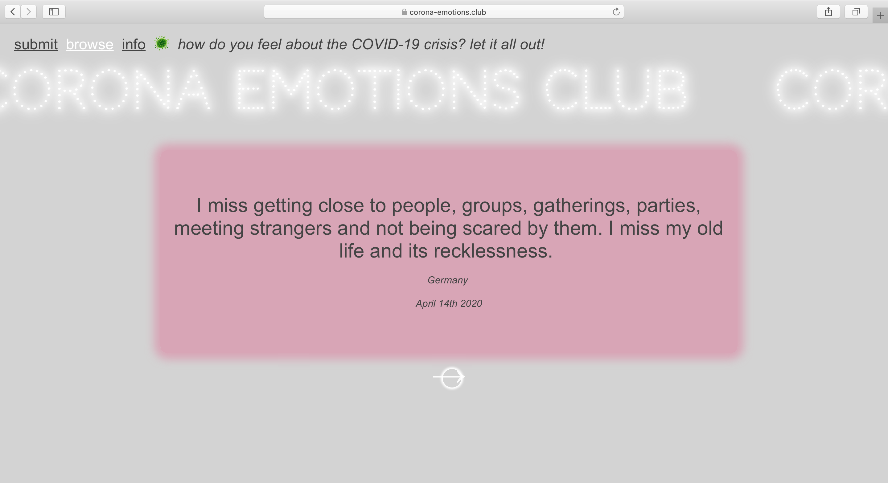
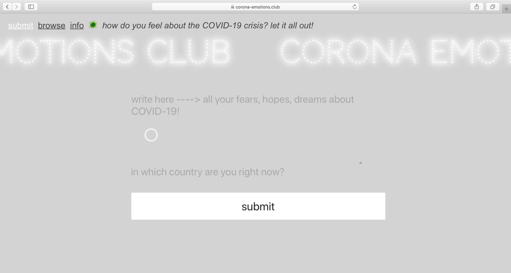

# React app about COVID-19

In this React app, users share their personal experiences of the COVID-19 outbreak and browse through others' submissions.   
This project's intention is to collect personal, emotional, yet global, perspectives on the situation.
When all this is over, I hope that it could serve as a digital
archive reminding us of this very strange time.
  
**Features**: submit form & browse section picking random submissions  
**Tech stack**: HTML, CSS, JavaScript, Node with Express.js, PostgreSQL  
**Testing**: React Testing Library + Jest  
**Framework**: React | **Deployment**: Heroku
