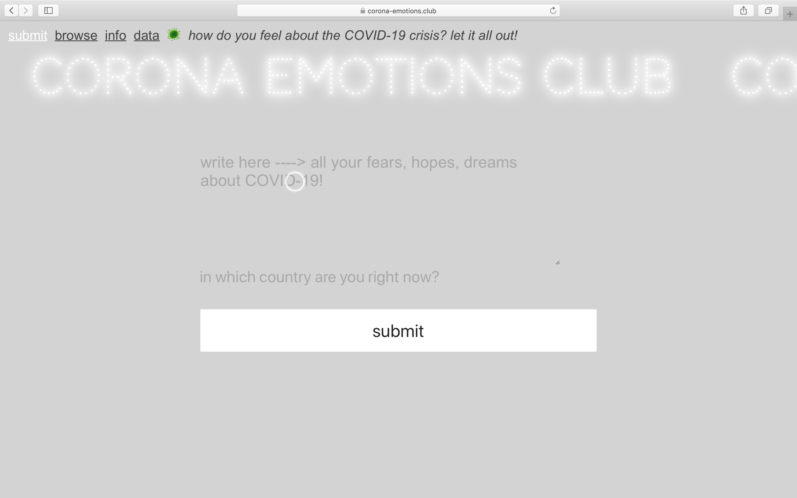
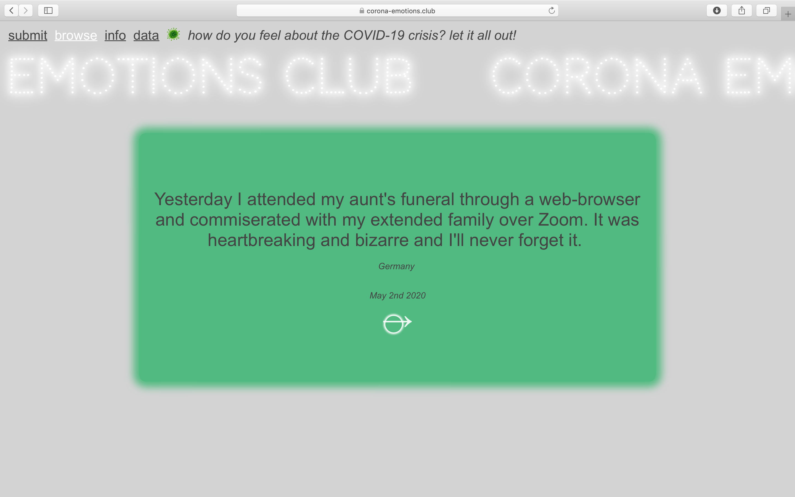

# CORONA EMOTIONS CLUB - React app about COVID-19

In this React app, users share their personal experiences of the COVID-19 outbreak and browse through others' submissions. 

This project's intention is to collect personal, emotional, yet global, perspectives on the situation.
When all this is over, I hope that it could serve as a digital archive reminding us of this very strange time.

[visit live app](https://corona-emotions.club)

## Features

-   submit form with error handling / success message
-   browse section picking random submissions in the database

## Tech

**Stack**: HTML, CSS, JavaScript, Node with Express.js, PostgreSQL  
**Protection**: CSURF  
**Testing**: React Testing Library + Jest  
**Framework**: React | **Deployment**: Heroku

## Visuals

